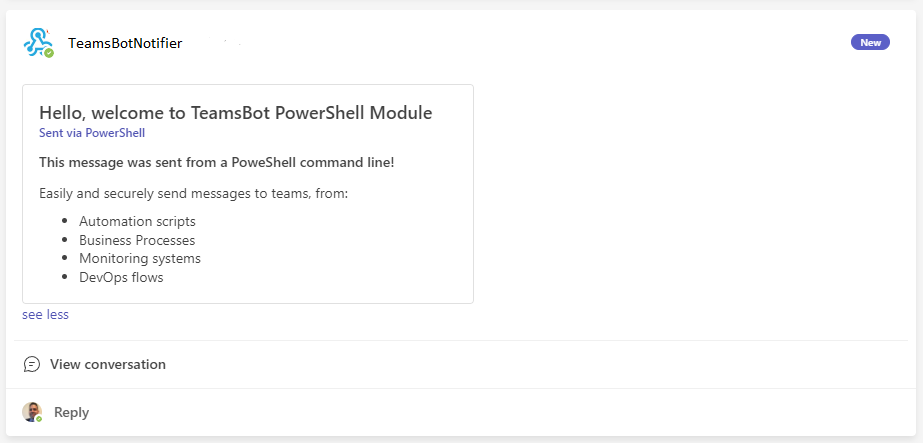

# TeamsBotPowerShellModule
## Send Teams messages to a teams channel using PowerShell!



&nbsp;
#### Based on the Teams Bots samples listed here:
https://github.com/OfficeDev/TeamsFx-Samples/tree/v1.0.0/incoming-webhook-notification


## Key features
   - Send Messages to a teams channel
   - Include Action buttons
   - Send Custom Adaptive cards
   - Works on Windows, Linux or Mac
   - Works on PowerShell 5 or PowerShell Core

## Use Cases
   - Use it as part of Automation and Alerting
   - Easy to use in Azure Functions (Instructions coming soon)
   - Use it with Azure Monitor to send Alerts to a teams Channel (Instructions coming soon)
   - Integration with Devops or Github to report status (Instructions coming soon)
         
# Instructions

1. [Add an incoming webhook in Teams](https://docs.microsoft.com/en-us/microsoftteams/platform/webhooks-and-connectors/how-to/add-incoming-webhook#create-an-incoming-webhook-1)
    ```
    Note: The Webhook Name is using facing, pick a nice name :-)
    ```
2. Install the latest version of TeamsBot from PowerShellGallery
    ```powershell
    Install-Module TeamsBot
    ```

2. Securely store the WebHookUrl (these should be treated as secrets)
    
    ```powershell
    # Note: This command will store the Url in an encrypted file under $Home

    Set-TeamsBotWebHookUrl -WebHookUrl https://xxxxxx
    ```
3. Send your first message
    ```powershell
    Send-TeamsBotMessage -Message "This is my first message" -Title "TeamsBot Message"
    ```

# Advanced features

## Additional security of the WebHookURL
* The module will first look for environment variable *TeamsBot_WebHookUrl* for the WebHookUrl.
* Alternatively, it can also be specified inline with the WebHookUrl parameter

This allows end users to store the WebhookUrl in a secure vault such as Azure KeyVault, retrieve via command line and set it as the environment variable
(instructions for this coming soon)

&nbsp;
## Additional Message options

### The *Send-TeamsBotMessage* command supports these additional parameters:

   - AppName <String>

       Optionally include the app name and make it clickiable using markdown

   - SubTitle <String>

       Optionally include a Subtitle which will appear in bold face

   - Table <Object>

       Optionally include a table of items (Array of PsCustomObject)
       Ex. an Object formatted like this:
       ```powershell
       $myTable=@()
       $myTable+=[PsCustomObject]@{Resource="Graph";App="Windows";User="Luis"}
       $myTable+=[PsCustomObject]@{Resource="Graph";App="Office";User="Mike"}
       ```
   - ActionButtonTitle <String>

       Optionally include an Action button, with this caption

   - ActionButtonLink <String>

       Url Link for the button
    
## Send a Customized Adaptive Card
   
### Use this option when:
   - You need to have multiple Action Buttons
   - You want to include multiple combinations of Tables and Textblocks
   - You want to customize the look and feel of the Card
     (Instructions coming soon)

